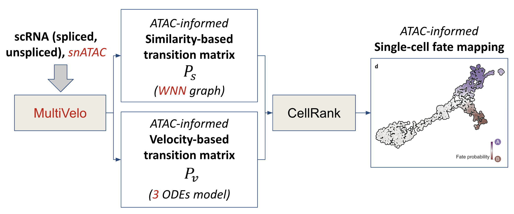

# Welcome to tandem-genomics!

This project was conducted by Aymeric Degroote (@aymeric-degroote) & Matthieu Dagommer (@MatDagommer) as part of Statistical Machine Learning for Genomics (BMENE4480), supervised by Prof. Elham Azizi, Dpt. of Biomedical Engineering, Columbia University.

In this project, we combine two libraries, [MultiVelo](https://github.com/welch-lab/MultiVelo) and [CellRank](https://github.com/theislab/cellrank), to simultaneously use RNA-seq and ATAC-seq data for cell trajectory inference. We do this by enriching the way velocity maps, a core component of cell trajectory inference, are computed. Velocity maps indicate the direction in which a cell's transcriptomics is evolving in gene expression space. [velocyto](https://github.com/velocyto-team/velocyto.R), the original velocity map framework used in **CellRank**, computes these maps based on gene expression (RNA-seq) and spliced/unspliced RNA ratios only, while **MultiVelo** adds chromatin accessibility (ATAC-seq) to the mix. By replacing velocyto with **MultiVelo** in the **CellRank** inference framework, we enrich the inference with chromatin accessibility when this data is available.

Why tandem? Because **CellRank** and **MultiVelo** work as a tandem!
Also, "Velo" means "bicycle" in French so "MultiVelo" naturally designates a tandem...

### Proposed pipeline:




Expected folder hierarchy:
```
.
|-- src
|   |-- notebook-multivelo.ipynb
|   |-- notebook-pathways.ipynb
|   |-- notebook-preprocess.ipynb
|   `-- notebook-tandem.ipynb
|-- plots
`-- data
    |-- outs
    |   |-- analysis
    |   |   `-- feature_linkage
    |   |       `-- feature_linkage.bedpe
    |   |-- filtered_feature_bc_matrix
    |   |   |-- barcodes.tsv.gz
    |   |   |-- features.tsv.gz
    |   |   `-- matrix.mtx.gz
    |   `-- peak_annotation.tsv
    |-- results
    |   |-- adata_atac_mouse_brain.h5ad
    |   |-- adata_rna_mouse_brain_analyzed.h5ad
    |   |-- adata_rna_mouse_brain.h5ad
    |   |-- GSEA_overlap_result_0.tsv
    |   |-- GSEA_overlap_result_1.tsv
    |   |-- GSEA_overlap_rna_0.tsv
    |   `-- GSEA_overlap_rna_1.tsv
    |-- seurat_wnn
    |   |-- nn_cells.txt
    |   |-- nn_dist.txt
    |   `-- nn_idx.txt
    |-- velocyto
    |   `-- 10X_multiome_mouse_brain.loom
    |-- cell_annotations.tsv
    `-- filtered_cells.txt
```


Notebooks should be executed in the following order:  
1. `notebook-preprocess.ipynb`  
2. `notebook-multivelo.ipynb`  
3. `notebook-tandem.ipynb`  
4. `notebook-pathways.ipynb`  


